<!-- About Me Section -->

<!-- ═══════════════════════════════════════════════════════════════════════ -->
<!--              🚀 ULTIMATE PROFESSIONAL HEADER - RAFI'S PROFILE 🚀        -->
<!-- ═══════════════════════════════════════════════════════════════════════ -->

<div align="center">
  
  <!-- Animated Banner -->
  
  
  <br/>
  
  <!-- ═══════════════════════ VISITOR COUNTER SECTION ═══════════════════════ -->
  
  <!-- Animated Visitor Badge -->
  
  
  <br/>
  
  <!-- Main Visitor Counter with Animation -->
  <p>
    
    
  </p>
  
  <!-- Alternative Visitor Counter -->
  <p>
    
  </p>
  
  <!-- Interactive Visitor Stats Grid -->
  <table align="center">
    <tr>
      <td align="center">
        <a href="https://visitorbadge.io/status?path=Rafi12234">
          
        </a>
      </td>
      <td align="center">
        <a href="https://visitorbadge.io/status?path=Rafi12234">
          
        </a>
      </td>
    </tr>
  </table>
  
  <!-- Decorative Divider -->
  
  
  <br/>
  
</div>

<!-- Status & Typing Section -->
<div align="center">
  
  <!-- Live Status Badges -->
  <p>
    
    
    
  </p>
  
  <br/>
  
  <!-- Primary Typing Animation -->
  <a href="https://github.com/Rafi12234">
    
  </a>
  
  <br/><br/>
  
  <!-- Secondary Skills Animation -->
  <a href="https://github.com/Rafi12234">
    
  </a>

  <!-- Animated Line -->
  
  <br/>

</div>
  
  <!-- Role Animation -->
  <a href="https://github.com/Rafi12234">
    
  </a>
  
</div>

```typescript
const rafi = {
    pronouns: "He" | "Him",
    location: "Dhaka, Bangladesh 🇧🇩",
    education: "CSE Student @ AUST",
    
    currentlyWorking: [
        "Full-Stack Web Development",
        "Flutter Mobile Apps", 
        "AI/ML Experiments"
    ],
    
    learning: ["Next.js", "MongoDB", "DevOps"],
    askMeAbout: ["React", "Flutter", "Firebase", "Python"],
    
    dailyRoutine: {
        morning: "☕ Coffee",
        afternoon: "💻 Code",
        evening: "🔧 Debug",
        night: "📚 Learn"
    },
    
    funFact: "I debug with console.log() and I'm proud of it! 🐛"
};
```
---
<!-- ═══════════════════════════════════════════════════════════════════════════════ -->
<!--                    🛠️ ULTIMATE PROFESSIONAL TECH STACK                          -->
<!-- ═══════════════════════════════════════════════════════════════════════════════ -->

<div align="center">

## ⚡ Tech Stack & Expertise


<br/>

<!-- Animated Header -->
<a href="https://github.com/Rafi12234">
  
</a>

</div>

<br/>

<!-- ═══════════════════════ LANGUAGES ═══════════════════════ -->
<div align="center">

### 「 💻 Programming Languages 」

<br/>

<a href="https://skillicons.dev">
  
</a>

</div>

<br/>

<!-- ═══════════════════════ FRAMEWORKS ═══════════════════════ -->
<div align="center">

### 「 🎨 Frontend & Frameworks 」

<br/>

<a href="https://skillicons.dev">
  
</a>

</div>

<br/>

<!-- ═══════════════════════ MOBILE ═══════════════════════ -->
<div align="center">

### 「 📱 Mobile Development 」

<br/>

<a href="https://skillicons.dev">
  
</a>

</div>

<br/>

<!-- ═══════════════════════ BACKEND ═══════════════════════ -->
<div align="center">

### 「 ⚙️ Backend & Database 」

<br/>

<a href="https://skillicons.dev">
  
</a>

</div>

<br/>

<!-- ═══════════════════════ TOOLS ═══════════════════════ -->
<div align="center">

### 「 🔧 DevOps & Tools 」

<br/>

<a href="https://skillicons.dev">
  
</a>

</div>

<br/>

<!-- ═══════════════════════ AI/ML ═══════════════════════ -->
<div align="center">

### 「 🤖 AI/ML & Data Science 」

<br/>

<a href="https://skillicons.dev">
  
</a>

<br/><br/>

<!-- Additional AI/ML icons using devicons -->
<p>
  
  
  
  
</p>

</div>

<br/>

<!-- ═══════════════════════ SKILL ICONS ═══════════════════════ -->
<div align="center">

### 「 🎯 All Technologies at a Glance 」

<br/>

<a href="https://skillicons.dev">
  
</a>

</div>

<br/>

<!-- ═══════════════════════ ANIMATED ICONS ═══════════════════════ -->
<div align="center">

### 「 ⚡ Core Competencies 」

<br/>

<p>
  
  
  
  
  
  
  
  
  
  
</p>

</div>

<br/>

<!-- ═══════════════════════ SKILL BARS ═══════════════════════ -->
<div align="center">

### 「 📊 Proficiency Levels 」

<br/>

| 🏷️ Category | 🛠️ Technologies | 📈 Proficiency |
|:----------:|:----------------|:--------------:|
| **Frontend** | React, Next.js, Vite, TailwindCSS |  |
| **Mobile** | Flutter, Dart, Android |  |
| **Backend** | Node.js, Express, Firebase |  |
| **Database** | MongoDB, MySQL, Firebase |  |
| **Languages** | JavaScript, Dart, Python, C++ |  |
| **DevOps** | Git, GitHub Actions, Docker |  |
| **AI/ML** | TensorFlow, Pandas, NumPy |  |

</div>

<br/>

<div align="center">


<br/>

<!-- Stats Summary -->
<p>
  
  
  
</p>

</div>

## 🚀 Featured Projects

<div align="center">

<!-- Animated Header -->


<br/>

<!-- Decorative Divider -->


</div>

<br/>

<!-- Project Cards Grid -->
<table align="center" border="0" cellpadding="20" cellspacing="0">
<tr>
<td width="50%" valign="top">

<div align="center">
  


<br/><br/>


</div>

<br/>

> 📱 **Comprehensive Mobile Application** for managing club activities, events, and member engagement

<table>
<tr><td>📅</td><td>Event scheduling & smart notifications</td></tr>
<tr><td>👥</td><td>Complete member management system</td></tr>
<tr><td>📢</td><td>Real-time announcements & updates</td></tr>
<tr><td>📊</td><td>Activity tracking & analytics</td></tr>
</table>

<div align="center">
  
[](https://github.com/Rafi12234/AUST-Robotics-Club-Mobile-Application)

</div>

</td>
<td width="50%" valign="top">

<div align="center">
  


<br/><br/>


</div>

<br/>

> 💜 **Full-Featured Web Application** providing guidance, tracking & community support for expecting mothers

<table>
<tr><td>🔐</td><td>Firebase Authentication</td></tr>
<tr><td>💾</td><td>Firestore Real-time Database</td></tr>
<tr><td>📦</td><td>Cloud Storage Integration</td></tr>
<tr><td>⚡</td><td>Real-time sync & updates</td></tr>
</table>

<div align="center">
  
[](https://github.com/Rafi12234/Pregnancy-Companion-Web-App-with-Firebase) [](https://github.com/Rafi12234/Pregnancy-Companion-Web-App)

</div>

</td>
</tr>

<tr><td colspan="2"></td></tr>

<tr>
<td width="50%" valign="top">

<div align="center">
  


<br/><br/>


</div>

<br/>

> 🏫 **Complete Management Solution** with dedicated mobile app & admin panel for AUSTians

<table>
<tr><td>📱</td><td>Cross-platform mobile application</td></tr>
<tr><td>💻</td><td>Web-based admin dashboard</td></tr>
<tr><td>📊</td><td>Data analytics & reports</td></tr>
<tr><td>🔒</td><td>Secure role-based authentication</td></tr>
</table>

<div align="center">
  
[](https://github.com/Rafi12234/Student-Management-System-for-AUSTians) [](https://github.com/Rafi12234/Student-Management-System-for-AUSTians-Admin-Panel)

</div>

</td>
<td width="50%" valign="top">

<div align="center">
  


<br/><br/>


</div>

<br/>

> 🤖 **AI-Driven Features** exploring intelligent user experiences through modern web technologies

<table>
<tr><td>🤖</td><td>AI feature integration</td></tr>
<tr><td>🎯</td><td>Smart recommendations engine</td></tr>
<tr><td>🔮</td><td>Predictive user interfaces</td></tr>
<tr><td>✨</td><td>Machine learning models</td></tr>
</table>

<div align="center">
  
[](https://github.com/Rafi12234/StratifyAI)

</div>

</td>
</tr>

<tr><td colspan="2"></td></tr>

<tr>
<td width="50%" valign="top">

<div align="center">
  


<br/><br/>


</div>

<br/>

> 🌐 **Modern Web Application** for IIUC event management and coordination

<table>
<tr><td>🌐</td><td>Fully responsive design</td></tr>
<tr><td>📱</td><td>Mobile-first interface</td></tr>
<tr><td>🔄</td><td>Real-time event updates</td></tr>
<tr><td>👥</td><td>User management portal</td></tr>
</table>

<div align="center">
  
[](https://github.com/Rafi12234/IIUC_25_Version2.0)

</div>

</td>
<td width="50%" valign="top">

<div align="center">
  


<br/><br/>


</div>

<br/>

> 🏆 **Comprehensive Web Platform** for robotics competition management & participant engagement

<table>
<tr><td>🏆</td><td>Competition tracking system</td></tr>
<tr><td>📊</td><td>Live leaderboards</td></tr>
<tr><td>📝</td><td>Registration & team management</td></tr>
<tr><td>🎮</td><td>Interactive dashboard</td></tr>
</table>

<div align="center">
  
[](https://github.com/Rafi12234/Robomania-2.0-Main-_WebApp)

</div>

</td>
</tr>
</table>

<br/>

<!-- Decorative Divider -->
<div align="center">

</div>

<br/>

## 🧪 Mini Projects & Experiments

<div align="center">


</div>

<br/>

<details>
<summary>

</summary>

<br/>

<div align="center">

| Project | Description | Tech |
|:-------:|:-----------:|:----:|
| [](https://github.com/Rafi12234/Full-Stack-Demo-Ecommerce) | Complete e-commerce platform demo |  |
| [](https://github.com/Rafi12234/Demo-Web-App-with-Firebase-Integration) | Firebase features showcase |  |
| [](https://github.com/Rafi12234/NutriTrack) | Nutrition tracking application |  |

</div>

</details>

<details>
<summary>

</summary>

<br/>

<div align="center">

| Project | Description | Tech |
|:-------:|:-----------:|:----:|
| [](https://github.com/Rafi12234/Ai-Image-Generator) | Jupyter notebook for image generation |  |
| [](https://github.com/Rafi12234/Pdf-to-Audio-Convertor) | Python utility for text-to-speech |  |

</div>

</details>

<details>
<summary>

</summary>

<br/>

<div align="center">

| Project | Description | Tech |
|:-------:|:-----------:|:----:|
| [](https://github.com/Rafi12234/WhatsApp-Messages-Analyzer) | Chat history analysis tool |  |
| [](https://github.com/Rafi12234/Detecting-Israeli-Product) | Product identification system |  |

</div>

</details>

<details>
<summary>

</summary>

<br/>

<div align="center">

| | | | |
|:---:|:---:|:---:|:---:|
| [](https://github.com/Rafi12234/Flappy--Bird) | [](https://github.com/Rafi12234/tic-tac-toe) | [](https://github.com/Rafi12234/calculator_app) | [](https://github.com/Rafi12234/Note-App) |
| Classic game recreation | Interactive game | Simple calculator | Note-taking app |

</div>

</details>

<br/>

<div align="center">

<!-- Call to Action -->


<br/>

[](https://github.com/Rafi12234?tab=repositories)

<br/>


</div>

## 📊 GitHub Analytics

<div align="center">

<!-- Using img tags with explicit loading and error handling -->
<a href="https://github.com/Rafi12234">
  
</a>
<a href="https://github.com/Rafi12234">
  
</a>

</div>

<div align="center">

<!-- Streak Stats with alternate domain -->
<a href="https://github.com/Rafi12234">
  
</a>

</div>

<div align="center">

<!-- GitHub Trophies -->
<a href="https://github.com/Rafi12234">
  
</a>

</div>

<div align="center">

<!-- Contribution Graph -->


</div>

<!-- Summary Cards as Backup -->
<details>
<summary>📈 Alternative Stats View (Click to Expand)</summary>
<br/>
<div align="center">

<a href="https://github.com/Rafi12234">
  
</a>

<a href="https://github.com/Rafi12234">
  
</a>
<a href="https://github.com/Rafi12234">
  
</a>

<a href="https://github.com/Rafi12234">
  
</a>
<a href="https://github.com/Rafi12234">
  
</a>

</div>
</details>

---

---

## 🌍 Global Contribution Insights

<div align="center">
  
</div>

---

## 🎯 Current Goals & Roadmap

```mermaid
graph LR
    A[✅ Master React & Firebase] --> B[⏳ Learn Next.js]
    B --> C[⏳ MongoDB Integration]
    C --> D[🎯 Full-Stack Production App]
    A --> E[⏳ CI/CD with GitHub Actions]
    E --> F[🎯 Deploy Demo Projects]
    A --> G[✅ Build Flutter Apps]
    G --> H[🎯 Play Store Launch]
```



### 🔥 In Progress
- 📚 Learning Next.js for server-side rendering
- 🗄️ Integrating MongoDB in full-stack projects
- 🧪 Writing unit tests & implementing CI/CD with GitHub Actions
- 🚀 Deploying production-ready demos (Vercel/Render)

### ✅ Recently Completed
- 📸 Added screenshots/GIFs for project READMEs
- 📝 Added descriptions + live demo links
- 🎨 Enhanced GitHub profile with dynamic widgets
- 🤖 Built IIUC 25 and Robomania 2.0 platforms

### ✨ Upcoming
- 🔐 Refactor Firebase rules & add security notes
- 📱 Launch apps on Google Play Store
- 🤝 Contribute to open-source projects
- 📝 Write technical blogs & tutorials

---

## 🏆 Achievements & Highlights

```
📦 20+ Projects Built        🚀 Active GitHub Contributor
🎓 CSE Student               💡 Problem Solver
🔧 Full-Stack Developer      📱 Mobile App Creator
🤖 AI/ML Enthusiast          ☕ Coffee-Powered Coder
```

---

## 💭 Random Dev Quote

<div align="center">


</div>

---

## 🤝 Let's Connect!

<div align="center">

[](https://portfolio-website-murex-kappa-83.vercel.app)
[](https://www.instagram.com/___r_._a_._f_._i___)
[](https://www.facebook.com/shajidul.kabir.5)
[](mailto:your-email@example.com)

</div>

<div align="center">

### 💬 "Code is like humor. When you have to explain it, it's bad." – Cory House

---

⭐️ **If you like my work, consider giving a star to my repositories!**

**Made with ❤️ and lots of ☕**

<!-- ═══════════════════════════════════════════════════════════════════════ -->
<!--                    👁️ TOTAL PROFILE ENGAGEMENT METRICS                  -->
<!-- ═══════════════════════════════════════════════════════════════════════ -->

<br/>


<br/>

<!-- Footer Visitor Counter -->
<p align="center">
  
  
  
</p>

<!-- Thank You Message -->


<br/>

<!-- Final Decorative Footer -->


</div>
