# 👋 Hey there, I'm Rafi! 

<div align="center">
  
[](https://git.io/typing-svg)

</div>

```typescript
const rafi = {
    location: "Dhaka, Bangladesh 🇧🇩",
    education: "CSE Student | Tech Enthusiast",
    currentFocus: ["Full-Stack Web Dev", "Flutter Apps", "AI/ML Experiments"],
    motto: "Building solutions that matter 💡",
    funFact: "I turn ☕ into <code/>"
};
```

---

## 🛠️ Tech Arsenal

<div align="center">

### 💻 Languages


### 🎨 Frontend


### 📱 Mobile


### ⚙️ Backend & Tools


</div>

---

## 🚀 Featured Projects

<table>
<tr>
<td width="50%">

### 🤖 AUST Robotics Club App
**Flutter | Dart | Mobile Development**

A comprehensive mobile application for managing club activities, events, and member engagement at AUST Robotics Club.

**Features:**
- 📅 Event scheduling & notifications
- 👥 Member management system
- 📢 Announcements & updates
- 📊 Activity tracking

[View Repository →](https://github.com/Rafi12234/AUST-Robotics-Club-Mobile-Application)

</td>
<td width="50%">

### 🤰 Pregnancy Companion
**React | Firebase | Full-Stack**

A full-featured web application providing guidance, tracking, and community support for expecting mothers.

**Tech Stack:**
- 🔐 Firebase Authentication
- 💾 Firestore Database
- 📦 Cloud Storage
- ⚡ Real-time updates

[Main Repo →](https://github.com/Rafi12234/Pregnancy-Companion-Web-App-with-Firebase)

</td>
</tr>

<tr>
<td width="50%">

### 🎓 Student Management System
**Flutter | Admin Panel | CRUD Operations**

Complete student management solution with dedicated mobile app and admin panel for AUSTians.

**Highlights:**
- 📱 Cross-platform mobile app
- 💻 Web-based admin dashboard
- 📊 Data analytics & reports
- 🔒 Secure authentication

[App Repo →](https://github.com/Rafi12234/Student-Management-System-for-AUSTians)

</td>
<td width="50%">

### 🧠 StratifyAI
**JavaScript | AI Integration | Frontend**

Exploring AI-driven features and intelligent user experiences through modern web technologies.

**Focus Areas:**
- 🤖 AI feature integration
- 🎯 Smart recommendations
- 🔮 Predictive interfaces

[View Repository →](https://github.com/Rafi12234/StratifyAI)

</td>
</tr>
</table>

---

## 🧪 Mini Projects & Experiments

<details>
<summary>📂 Click to explore more projects!</summary>

### 🎨 Web Applications
- **[Full-Stack Demo Ecommerce](https://github.com/Rafi12234/Full-Stack-Demo-Ecommerce)** - Complete e-commerce platform demo
- **[Firebase Integration Demo](https://github.com/Rafi12234/Demo-Web-App-with-Firebase-Integration)** - Firebase features showcase
- **[NutriTrack](https://github.com/Rafi12234/NutriTrack)** - Nutrition tracking application

### 🤖 AI/ML Tools
- **[AI Image Generator](https://github.com/Rafi12234/Ai-Image-Generator)** - Jupyter notebook for image generation
- **[PDF to Audio Converter](https://github.com/Rafi12234/Pdf-to-Audio-Convertor)** - Python utility for text-to-speech conversion

### 📊 Utilities
- **[WhatsApp Messages Analyzer](https://github.com/Rafi12234/WhatsApp-Messages-Analyzer)** - Chat history analysis tool
- **[Detecting Israeli Products](https://github.com/Rafi12234/Detecting-Israeli-Product)** - Product identification system

### 🎮 Fun Projects
- **[Flappy Bird](https://github.com/Rafi12234/Flappy--Bird)** - Classic game recreation
- **[Tic Tac Toe](https://github.com/Rafi12234/tic-tac-toe)** - Interactive game
- **[Calculator App](https://github.com/Rafi12234/calculator_app)** - Simple calculator
- **[Note App](https://github.com/Rafi12234/Note-App)** - Note-taking application

</details>

---

## 📊 GitHub Analytics

<div align="center">


</div>

<div align="center">

[](https://git.io/streak-stats)

</div>

---

## 🎯 Current Goals & Roadmap

```mermaid
graph LR
    A[✅ Master React & Firebase] --> B[⏳ Learn Next.js]
    B --> C[⏳ MongoDB Integration]
    C --> D[🎯 Full-Stack Production App]
    A --> E[⏳ CI/CD with GitHub Actions]
    E --> F[🎯 Deploy Demo Projects]
    A --> G[✅ Build Flutter Apps]
    G --> H[🎯 Play Store Launch]
```



### 🔥 In Progress
- 📚 Learning Next.js for server-side rendering
- 🗄️ Integrating MongoDB in full-stack projects
- 🧪 Writing unit tests & implementing CI/CD
- 🚀 Deploying production-ready demos

### ✨ Upcoming
- 📱 Launch apps on Google Play Store
- 🌐 Build a personal portfolio website
- 🤝 Contribute to open-source projects
- 📝 Write technical blogs & tutorials

---

## 🏆 Achievements & Highlights

<div align="center">


</div>

```
📦 10+ Projects Built        🚀 Active GitHub Contributor
🎓 CSE Student               💡 Problem Solver
🔧 Full-Stack Developer      📱 Mobile App Creator
🤖 AI/ML Enthusiast          ☕ Coffee-Powered Coder
```

---

## 💭 Random Dev Quote

<div align="center">


</div>

---

## 🤝 Let's Connect!

<div align="center">

[](https://www.instagram.com/___r_._a_._f_._i___)
[](https://www.facebook.com/shajidul.kabir.5)
[](mailto:your-email@example.com)

</div>

<div align="center">

### 💬 "Code is like humor. When you have to explain it, it's bad." – Cory House

---

⭐️ **If you like my work, consider giving a star to my repositories!**

**Made with ❤️ and lots of ☕**

</div>
